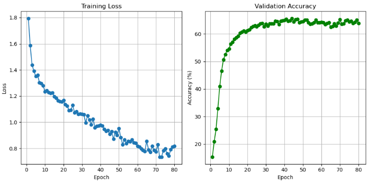
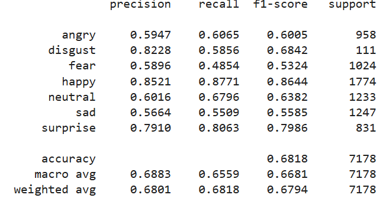
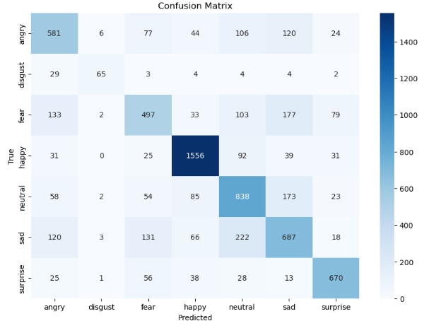

# Facial Expression Recognition with Vision Transformers (FER2013)

**Students Names**: Hila Levi Yosefi and Noa Amsalem

Robust Facial Expression Recognition (FER) using a pretrained **ViT/MAE** backbone with partial freezing and fine-tuning on **FER2013**.

---

## Overview

- **Backbone:** Vision Transformer Masked Autoencoder (**ViTMAE**) pretrained on ImageNet
- **Transfer learning:** Freeze **embeddings + blocks [0..3]**, fine-tune higher layers
- **Task:** 7-class FER on FER2013 (Angry, Disgust, Fear, Happy, Sad, Surprise, Neutral)
- **Frameworks:** PyTorch, Hugging Face `transformers`, `timm`

---

## Repository Structure

```
.
├── Code Files/
│   └── FER_ViT.ipynb              # Main notebook for training and evaluation
│
├── Dataset/
│   └── archive.zip                # FER2013 dataset (Kaggle)
│
├── Images/
│   ├── plots.png                  # Training and validation loss/accuracy curves
│   ├── classification_report.png  # Classification report (precision, recall, F1)
│   └── confusion_matrix.png       # Confusion matrix of predictions
│
├── Project Presentation/
│   └── project_presentation.pdf   # Project presentation (slides)
│
├── Project Report/
│   └── FER_project_report.pdf     # Written report
│
├── README.md                      # Project documentation (this file)
└── requirements.txt               # Python dependencies

```

---

## Installation

```bash
pip install -r requirements.txt
```

---

## Data: FER2013

Download 'Dataset/archive.zip'  

Typical transforms:
- Resize to **224×224**
- Random crop + horizontal flip
- Normalize to ImageNet stats

---

## Quickstart

Open and run:
```
Code Files/FER_ViT.ipynb
```

The notebook:
- Loads FER2013
- Builds a **ViTMAE** classifier head
- **Freezes embeddings + first 4 transformer blocks**
- Trains with **AdamW** + **CosineAnnealing**
- Logs validation accuracy and loss
- Saves plots

---

## Training Configuration

- **Backbone:** `ViTMAEModel` (Hugging Face)
- **Head:** Linear classifier on `[CLS]` token → 7 classes
- **Frozen:** embeddings + blocks `[0..3]` (total 12 blocks)
- **Loss:** CrossEntropyLoss
- **Optimizer:** AdamW (lr=3e-5, weight decay)
- **Scheduler:** Cosine Annealing
- **Augmentations:** resize(224), random crop, horizontal flip, normalization

---

## Hyperparameters

- **Backbone:** ViTMAE pretrained on ImageNet
- **Frozen layers:** Embeddings + first 4 transformer blocks (out of 12)
- **Input size:** 224×224 (resized from 48×48 grayscale)
- **Batch size:** 64
- **Epochs:** 80
- **Loss function:** CrossEntropyLoss
- **Optimizer:** AdamW
  - Learning rate: 3e-5
  - Weight decay: 0.01
- **Scheduler:** Cosine Annealing
- **Augmentations:**
  - Resize → Random Crop → Horizontal Flip → Normalize (ImageNet stats)

---
## Results (from latest run)

- **Epoch 1:** loss=1.7946, val_acc=15.26%
- **Epoch 2:** loss=1.5859, val_acc=20.84%
- **Epoch 3:** loss=1.4388, val_acc=25.37%
- **...**
- **Epoch 78:** loss=0.7907, val_acc=64.29%
- **Epoch 79:** loss=0.8128, val_acc=65.09%
- **Epoch 80:** loss=0.8173, val_acc=63.80%

**Observations**
- Outperforms random guessing (~14.3%) early on
- Stronger recognition for **Happy**/**Disgust**
- Confusions between **Sad** and **Neutral** (class imbalance effect)

---

## Evaluation

The notebook evaluates on validation/test split and can produce:
- Accuracy
  
  

- Classification report
  
    

- Confusion matrix
  
  
